[](https://twitter.com/intent/follow?screen_name=api_video)
&nbsp; [](https://github.com/apivideo/api.video-android-live-stream)
&nbsp; [](https://community.api.video)

<h1 align="center">api.video videos backup to Azure Storage account</h1>

[api.video](https://api.video) is the video infrastructure for product builders. Lightning fast
video APIs for integrating, scaling, and managing on-demand & low latency live streaming features in
your app.

# Project description

api.video provides you with a convenient way of making a backup of your transcoded videos. With the current script, you'll be able to backup the videos to Google Storage, Azure Storage account and Amazon S3.

## Preparation

**What we will need to run the script?**

Depending on where you are going to backup your videos, you will need to prepare few things for the script and change keys in the `.env` file.

### api.video

from api.video, you'll need to get the API key.

- **[api.video](http://api.video) API key**, you can find the information on how to retrieve the [API key in the Retrieve your api.video API key guide](https://docs.api.video/reference/authentication-guide#retrieve-your-apivideo-api-key)
- [api.video](http://api.video) Cold Storage script


### NPM and Typescript installation

* **Node.js** and **npm**, you can find the installation instructions [here](https://docs.npmjs.com/downloading-and-installing-node-js-and-npm)
* **Typescript**, you can find the installation instructions [here](https://www.npmjs.com/package/typescript)

### Azure Storage account

If you are preparing to backup to Azure Storage account, you can find the credentials you'll need below

- [Azure Account Key](https://learn.microsoft.com/en-us/azure/storage/common/storage-account-keys-manage?tabs=azure-portal), or use any other credential system that Azure provides
- Azure storage account name

**Getting the Azure Storage Account name**

- Navigate to your Azure portal
- Click on Storage Account  
- You’ll find the Storage Account in the list
  

### Google Storage account

Preparing to the backup to Google account, you can follow the below steps. You will need to [create a service account for the Storage account](https://support.google.com/a/answer/7378726?sjid=1556077145065480779-EU)

- On Google Cloud Platform, navigate to the menu and select `APIs and services`
- Select `Enabled APIs and services`
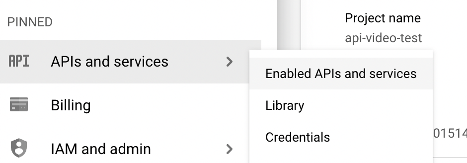
- Click on `+ ENABLE APIS AND SERVICES`
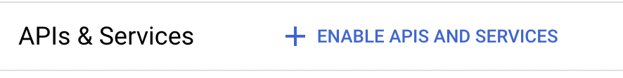
- Search for `Storage` and select `Storage Cloud`
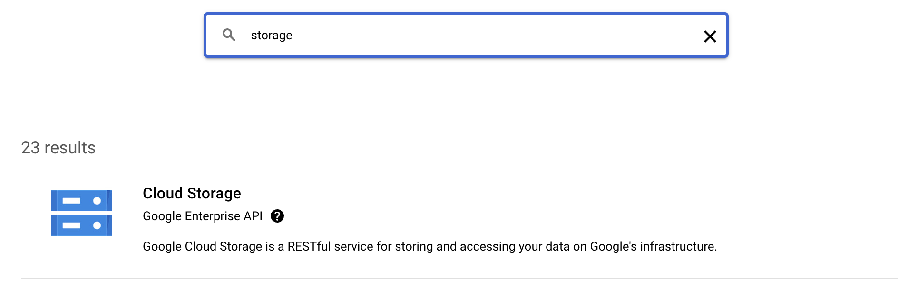
- If the API is not enabled, click on `Enable API`, and `Manage`
- In the `API services details` click on `+ Create credentials`
- Select `Service account`
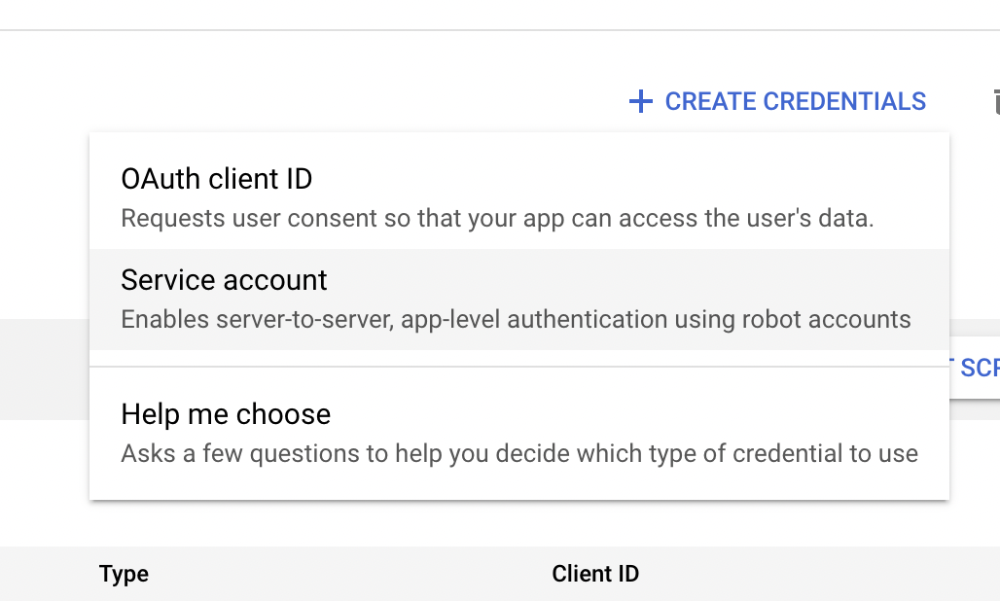
- Fill out the details in the `Create Service Account` screen, click on `Create and Continue`
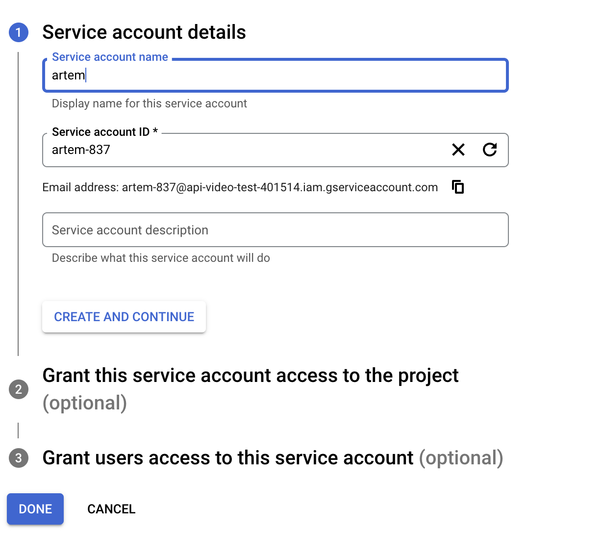
- In the optional pane `Grant this service account access to the project` grant the Storage Admin role and click continue
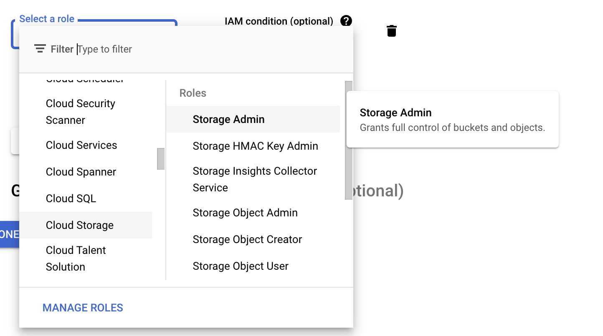
- Add the user to the service account and click `Done`
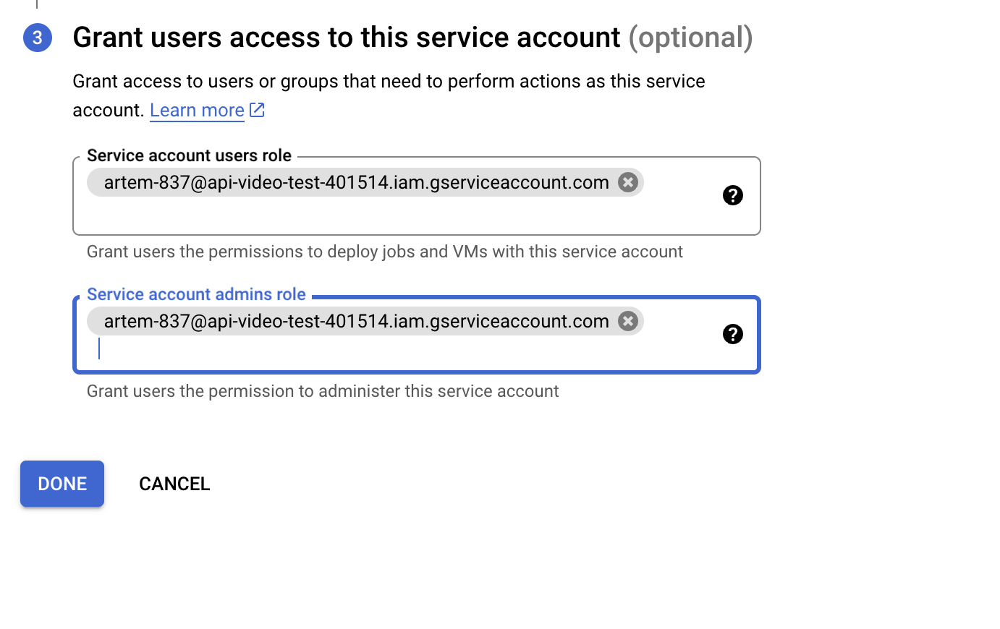
- On the `API/Service details` click on the Service account that was just created, under Service Accounts
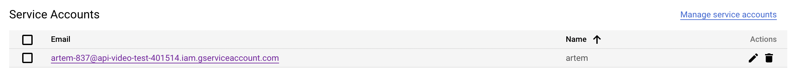
- In the Service Account screen, navigate to the `Keys`tab
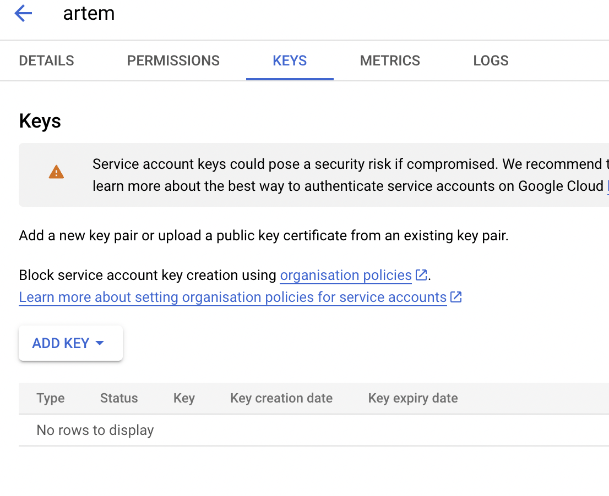
- Click on `Add Key` and `Create new key`, a pop-up will appear, select `JSON` and then `Create`.
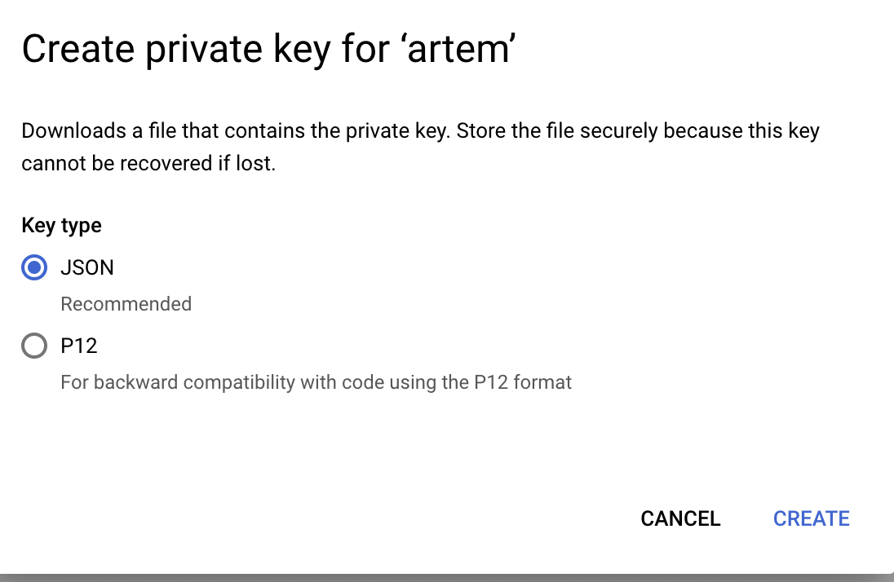
- This action will trigger a download of a JSON file that will storage on your machine/
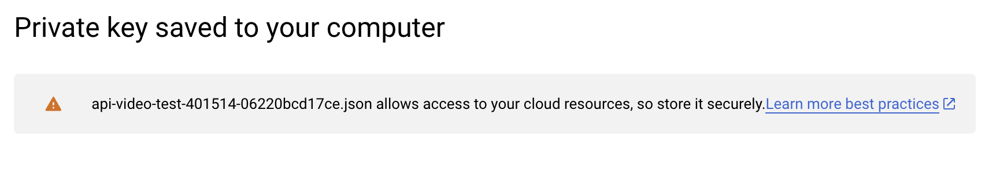
- Copy the content of the JSON file
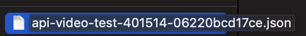
- Copy the content into the `.env` in the `GCP_KEY` parameter. Note that the parameter should be a string, so encapsulate the JSON into `''`
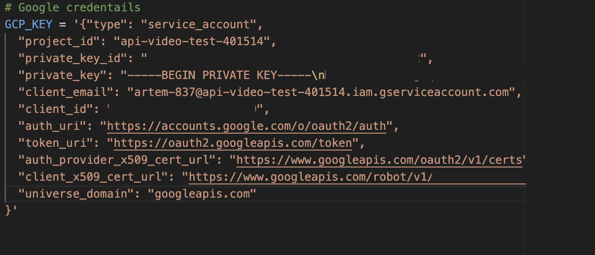

### Amazon S3

For Amazon S3, you need to get the Access Key, Secret Key and region.

- Get the [Amazon S3 credentials](https://docs.aws.amazon.com/sdk-for-javascript/v2/developer-guide/getting-started-nodejs.html#getting-started-nodejs-credentials)
- Copy the region from the console

## Getting Started

After you’ve got all the keys and installed node.js, npm and typescript, you can proceed with cloning the script from GitHub.

### Setting up the script

Once you are in the script directory, install the dependencies

```bash
$ npm install
```

After the dependencies are installed, we will need to enter the credentials we have copied in the preparation phase.

Edit the `.env` file and replace the following with the keys you've received from the provider and [api.video](http://api.video/). 

Make sure to mark the `PROVIDER` value, which will indicate the script where to run the backup. The possible values for the `PROVIDER` parameter are:

- `google`
- `aws`
- `azure`

Note that, you only need to fill out the credentials for the provider you chose. You can only choose one provider at a time.

```bash
# possible providers: google, aws, azure
PROVIDER = ""

# api.video API key
APIVIDEO_API_KEY = "api_video_key"

# the name of the bucket on Google Amazon S3 or the container on Azure Storage
SPACE_NAME = ""

# Azure credentials
AZURE_ACCOUNT_KEY = ""
AZURE_STORAGE_ACCOUNT_NAME = ""

# Amazon S3 credentials
AWS_ACCESS_KEY_ID = ""
AWS_SECRET_ACCESS_KEY = ""
AWS_REGION = ""

# Google credentails
GCP_KEY = '{
}'
```

Don’t forget to save the file. 

## Running the backup

Once all the keys are in place in the `.env` file, it's time to run the script. As we are running the script on TypeScript, we will need to build it first, hence, the first command you need to run in the script folder is:

```bash
$ npm run build
```

After the script was built, it’s time to run it:

```bash
$ npm run backup 
```

# FAQ

If you have any questions, ask us in the [community](https://community.api.video)
